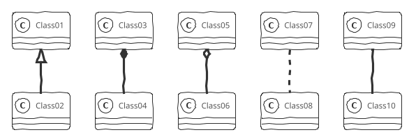
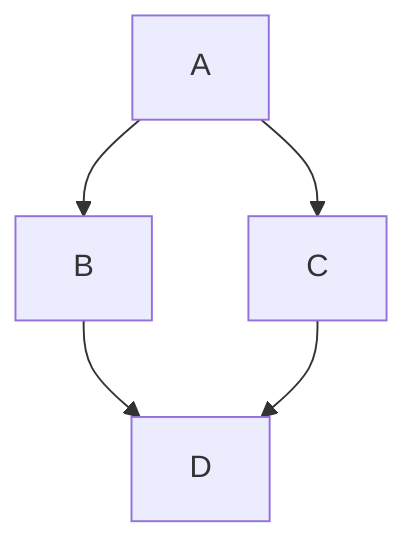
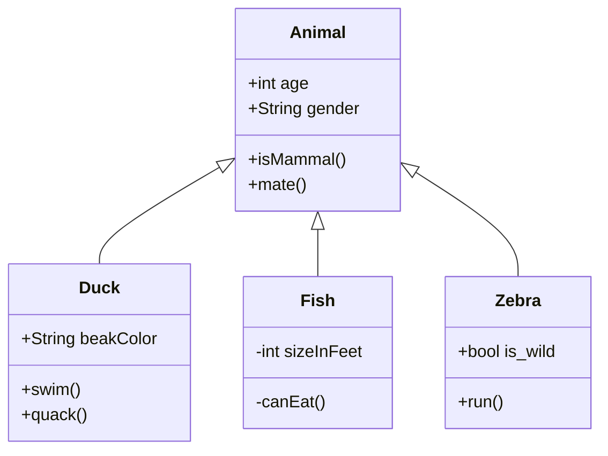
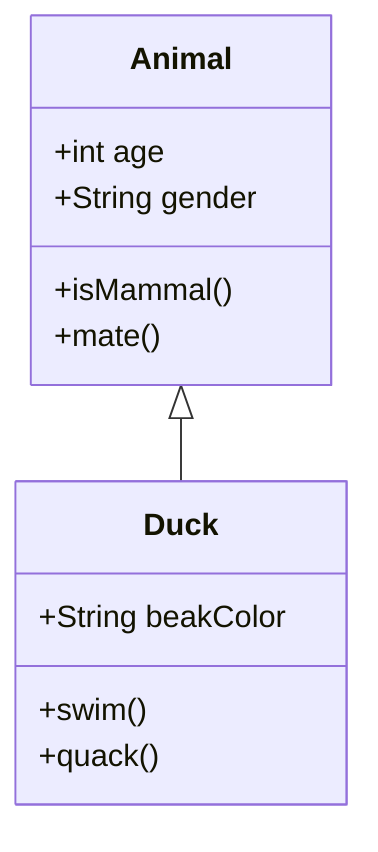
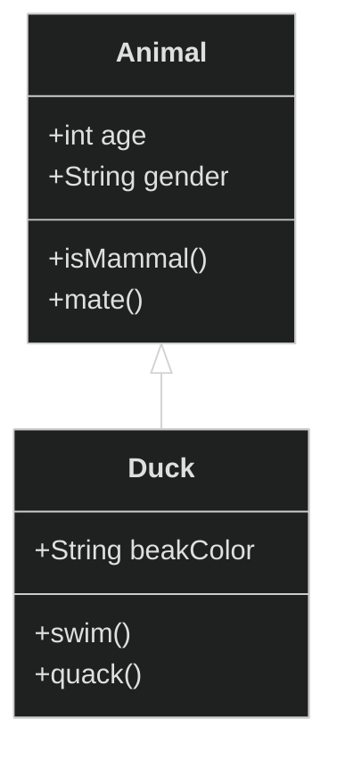
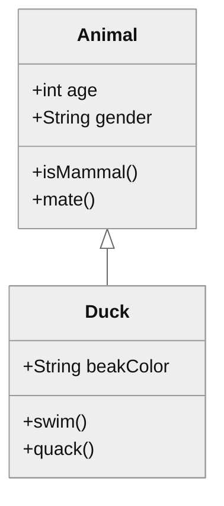
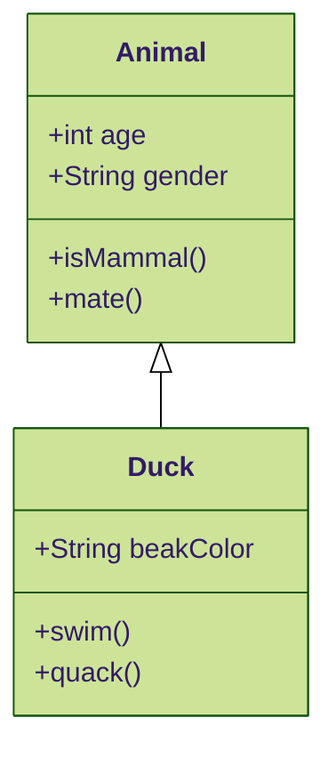

# Spring Security

In `SampleControllerServerIntegrationTest` test we have removed the basic authentication default header (by overriding
at method level) from the `RestTestClient` only for a specific test method and run the test as an unauthenticated user
and make sure that the endpoint is not accessible without authentication and returns `401 Unauthorized`.

