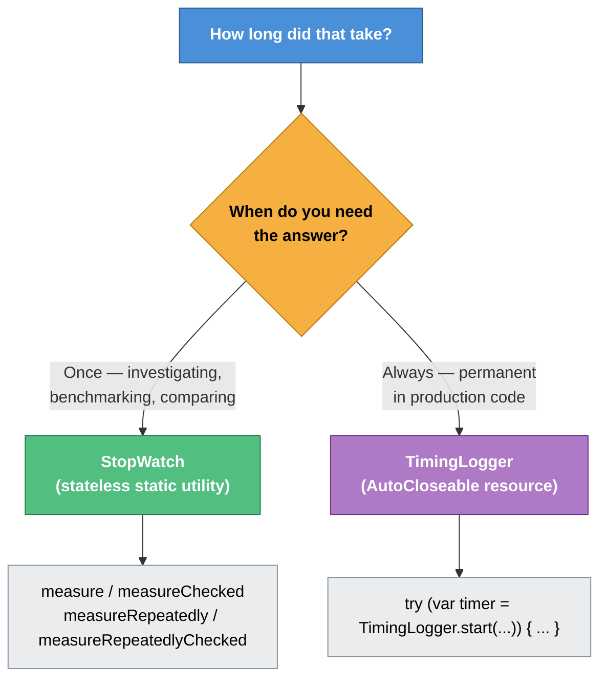
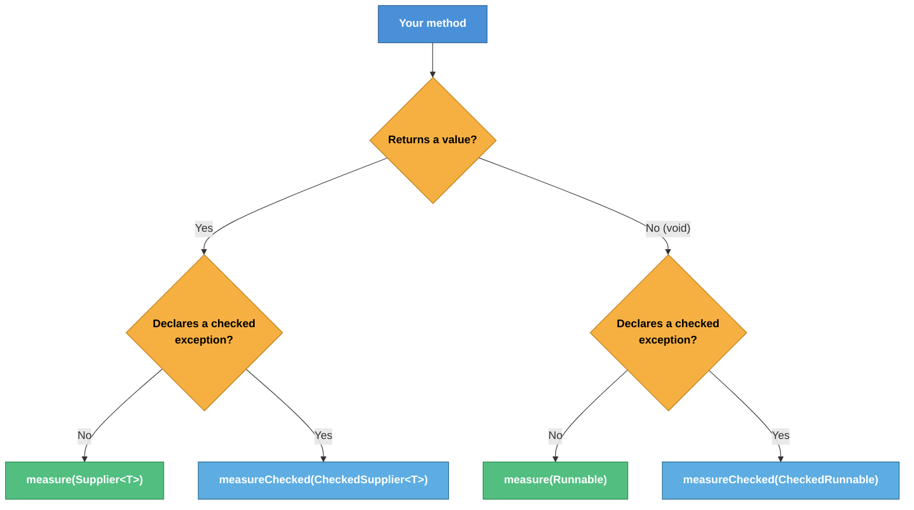
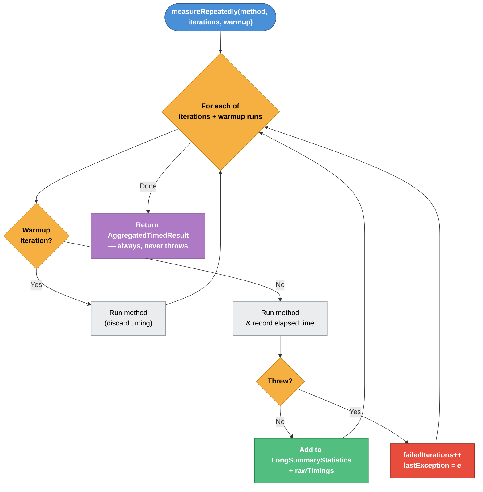
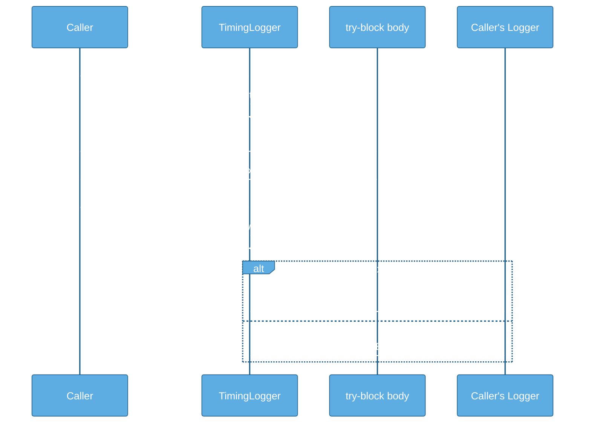
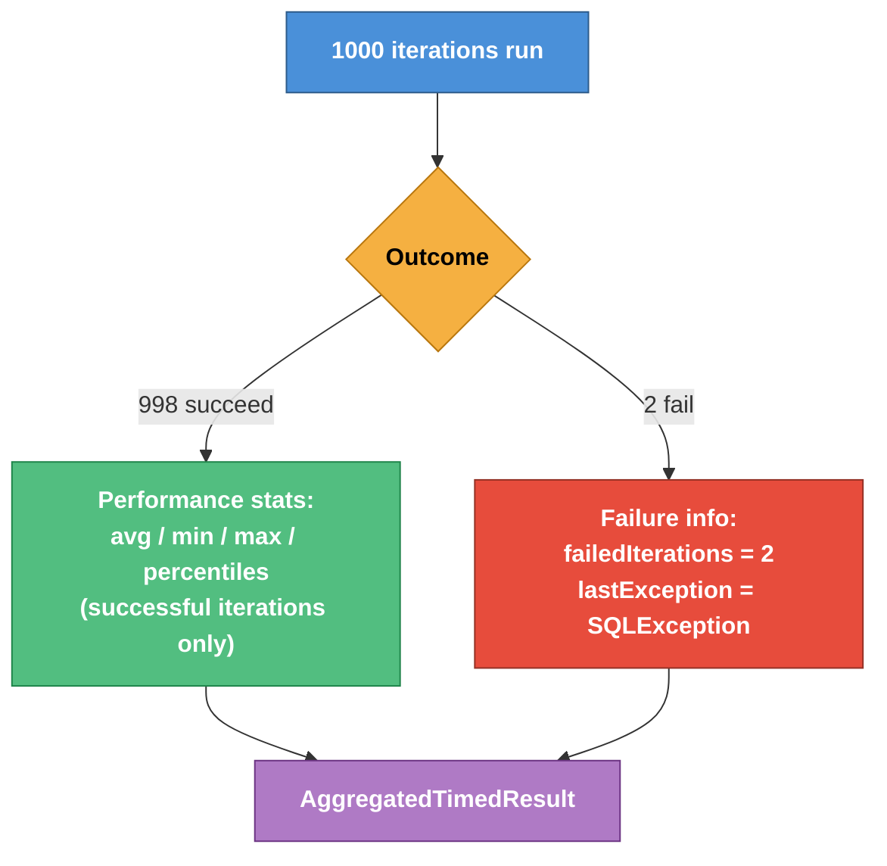
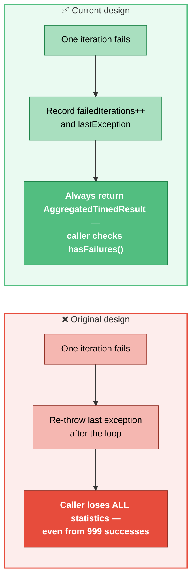

<div align="center">

# ⏱️ Java Timing Utility Library

**A focused, dependency-light toolkit for measuring method execution time —**
**for deliberate performance investigations *and* permanent production logging.**


`dev.badprogrammer.util.timing`

</div>

<br>

## 📑 Table of Contents

- [🎯 Overview](#-overview)
- [🤔 Why This Library Exists](#-why-this-library-exists)
- [🧭 Design Philosophy](#-design-philosophy)
- [🛠️ Tech Stack & Prerequisites](#️-tech-stack--prerequisites)
- [🚀 Getting Started](#-getting-started)
- [📦 Package Structure](#-package-structure)
- [✨ Features](#-features)
  - [🔍 Single Measurement — `measure` / `measureChecked`](#-single-measurement--measure--measurechecked)
  - [🔁 Repeated Measurement — `measureRepeatedly` / `measureRepeatedlyChecked`](#-repeated-measurement--measurerepeatedly--measurerepeatedlychecked)
  - [📝 Ambient Production Timing — `TimingLogger`](#-ambient-production-timing--timinglogger)
  - [🧩 Supporting Types](#-supporting-types)
- [🧠 Design Decisions & Their Reasoning](#-design-decisions--their-reasoning)
- [✅ Best Practices](#-best-practices)
- [🗺️ Implementation Status & Roadmap](#️-implementation-status--roadmap)

---

## 🎯 Overview

This library answers one question, asked in two very different contexts:

> ### *"How long did that take?"*

Sometimes you ask this **once, deliberately** — while investigating a performance issue, writing a benchmark, or comparing two implementations during development. Sometimes you want the answer **always, silently** — a permanent fixture in production code that logs elapsed time without anyone having to remember it's there.

This library provides one class for each context:

<div align="center">

| | `StopWatch` | `TimingLogger` |
|:---:|:---|:---|
| **Use case** | Situational, deliberate measurement — benchmarking, investigations, comparisons | Permanent, ambient measurement embedded in production code |
| **Lifecycle** | Stateless static utility | Per-invocation `AutoCloseable` resource |
| **Lives** | In a test, a debugger session, a benchmark harness | In the method body, forever |

</div>



Both are built around the same core idea — **measure in nanoseconds, report in milliseconds** — but deliberately take different shapes to solve different problems.

---

## 🤔 Why This Library Exists

Most Java codebases accumulate timing code in one of two unsatisfying forms:

- Scattered `System.nanoTime()` pairs with manual subtraction, duplicated across the codebase, easy to get subtly wrong — forgetting unit conversions, measuring the wrong scope, or leaking timing code into business logic.
- Ad-hoc `try { ... } finally { log.debug("took {}ms", ...) }` blocks that vary in format from method to method, making logs hard to search or aggregate.

This library exists to make both of these **boring** — a single, well-tested, consistent way to answer *"how long did that take?"*, whether the answer is needed once during an investigation or every time, forever, in production.

---

## 🧭 Design Philosophy

These principles were established early and apply across every class in the library:

- 🚫 **No side effects.** Neither `StopWatch` nor `TimingLogger` retries, caches, modifies, or intercepts the measured method in any way. Any side effect you observe is the method's own.
- 📐 **Measure in nanos, report in millis.** `System.nanoTime()` is used internally for maximum precision. Millisecond conversions happen only at the point of retrieval — via `TimeUnit.NANOSECONDS.toMillis()` — so no rounding error accumulates during aggregation.
- 🔁 **Always return, never throw (for repeated measurement).** `measureRepeatedly()` and `measureRepeatedlyChecked()` always return a result, even when every iteration fails. Failure information is *inspected*, not *caught*.
- 🧪 **A slow failure is not the same as a slow success — keep them separate.** Failed-iteration timings do not pollute performance statistics. Failures are represented by a count and an exception, not by mystery numbers mixed into an average.
- 🔧 **The right tool has the right shape.** `StopWatch` is a stateless static utility because it needs no state. `TimingLogger` is an `AutoCloseable` instance because it must carry a start time across a `try`-block's lifetime. Neither is forced into the other's shape for the sake of "consistency."

---

## 🛠️ Tech Stack & Prerequisites

| Requirement | Details |
|---|---|
| ☕ **Java** | 17 or later — uses `var`, `String.formatted()`, `java.util.Optional`, `java.util.LongSummaryStatistics` |
| 📋 **SLF4J API** | Required at compile time for `TimingLogger` only. Bring your own binding (Logback, Log4j2, etc.) |
| 🧪 **Test dependencies** | JUnit 5, Mockito — test scope only, not required by consumers |

> [!NOTE]
> `StopWatch` and its supporting types (`TimedResult`, `AggregatedTimedResult`, `CheckedSupplier`, `CheckedRunnable`) are **pure Java with zero dependencies**.

---

## 🚀 Getting Started

> [!NOTE]
> Maven Central coordinates will be published once the library reaches its first stable release. Until then, vendor the `dev.badprogrammer.util.timing` package directly into your project's source.

A minimal taste of both classes:

```java
import dev.badprogrammer.util.timing.StopWatch;
import dev.badprogrammer.util.timing.TimingLogger;

// One-off measurement during an investigation
var result = StopWatch.measure(() -> cache.get("key"));
System.out.println("Took " + result.getElapsedMillis() + "ms");

// Permanent production timing
public Connection getConnection() throws SQLException {
    try (var timer = TimingLogger.start("getConnection", log)) {
        return dataSource.getConnection();
    }
}
```

---

## 📦 Package Structure

```
dev.badprogrammer.util.timing
├── StopWatch                — stateless utility: measure, measureRepeatedly
├── TimingLogger              — AutoCloseable: ambient production timing
├── TimedResult<T>            — result of a single measured invocation
├── AggregatedTimedResult     — statistics from repeated invocations
├── CheckedSupplier<T>        — Supplier<T> that may throw a checked exception
└── CheckedRunnable           — Runnable that may throw a checked exception
```

---

## ✨ Features

### 🔍 Single Measurement — `measure` / `measureChecked`

Times **one invocation** of a method and returns both its result and its elapsed time, wrapped in a `TimedResult<T>`.

```java
// Returns a value, no checked exception
TimedResult<String> result = StopWatch.measure(() -> cache.get("key"));
String value = result.getResult();
long   millis = result.getElapsedMillis();

// Returns a value, declares a checked exception
TimedResult<Connection> result = StopWatch.measureChecked(() -> dataSource.getConnection());

// Void method, no checked exception
TimedResult<Void> result = StopWatch.measure(() -> cache.evictAll());

// Void method, declares a checked exception
TimedResult<Void> result = StopWatch.measureChecked(() -> connection.close());
```

#### 🧭 Method naming convention

Every measurement method in this library comes in two variants — `measure` and `measureChecked`. The name itself tells you which one to reach for:

| Your method... | Use |
|---|---|
| Returns a value, **no** checked exception | `measure(Supplier<T>)` |
| Returns a value, **declares** a checked exception | `measureChecked(CheckedSupplier<T>)` |
| Is `void`, **no** checked exception | `measure(Runnable)` |
| Is `void`, **declares** a checked exception | `measureChecked(CheckedRunnable)` |



This naming convention is used consistently for `measureRepeatedly` / `measureRepeatedlyChecked` as well, and will extend to the upcoming `compare` / `compareChecked` methods.

---

### 🔁 Repeated Measurement — `measureRepeatedly` / `measureRepeatedlyChecked`

Invokes a method a fixed number of times and returns an `AggregatedTimedResult` — statistics across all **successful** invocations, plus failure tracking.

```java
AggregatedTimedResult stats = StopWatch.measureRepeatedlyChecked(
        () -> dataSource.getConnection(),
        1000,  // iterations
        5);    // warmup iterations

System.out.println(stats);
// AggregatedTimedResult[Total iterations = 1000, Successful iterations = 998,
//   Failed iterations = 2, Total elapsed time = 11976ms,
//   Average elapsed time = 12.001ms, Minimum elapsed time = 8ms,
//   Maximum elapsed time = 45ms, Last exception = SQLException: connection timeout]

if (stats.hasFailures()) {
    stats.getLastException().ifPresent(e ->
            log.warn("{} of {} iterations failed: {}",
                    stats.getFailedIterations(), stats.getTotalIterations(), e.getMessage()));
}
```



#### 🔥 Warmup iterations

The first `warmupIterations` invocations run normally — their side effects happen — but their timings are **excluded** from statistics. This prevents JVM class-loading and JIT compilation overhead from skewing the numbers for an otherwise well-optimized method.

#### ⚠️ Failure handling

If an invocation throws:

- the failure count is incremented,
- the exception is retained as the **last exception**,
- execution **continues** with the next iteration,
- and the failed iteration's timing is **excluded** from statistics.

> [!IMPORTANT]
> `measureRepeatedly` and `measureRepeatedlyChecked` **always return** an `AggregatedTimedResult` — even if *every single iteration* fails. There is nothing to catch.

```java
// All 1000 iterations fail — still returns a valid result, never throws
AggregatedTimedResult stats = StopWatch.measureRepeatedly(() -> unreliableCall(), 1000, 0);

stats.hasFailures();             // true
stats.getFailedIterations();     // 1000
stats.getSuccessfulIterations(); // 0
stats.getLastException();        // Optional containing the last exception thrown
```

#### 📊 `AggregatedTimedResult` accessors

| Method | Returns |
|---|---|
| `getTotalNanos()` / `getTotalMillis()` | Sum of elapsed time across successful iterations |
| `getAverageNanos()` / `getAverageMillis()` | Mean elapsed time per successful iteration |
| `getMinNanos()` / `getMinMillis()` | Fastest successful iteration |
| `getMaxNanos()` / `getMaxMillis()` | Slowest successful iteration |
| `getSuccessfulIterations()` | Count of iterations that did not throw |
| `getFailedIterations()` | Count of iterations that threw |
| `getTotalIterations()` | `getSuccessfulIterations() + getFailedIterations()` |
| `hasFailures()` | `true` if any iteration threw |
| `getLastException()` | `Optional<Exception>` — the last exception thrown, if any |

---

### 📝 Ambient Production Timing — `TimingLogger`

A non-invasive `AutoCloseable` that times a method body and logs the elapsed time automatically when the `try` block exits — normally **or** via exception.

```java
public Connection getConnection() throws SQLException {
    try (var timer = TimingLogger.start("getConnection", log)) {
        return dataSource.getConnection();
    }
}
// Logs: TIMED | getConnection | elapsed = 12ms (12004311ns)
```



#### 🐢 Slow-call detection

Pass a threshold in milliseconds. If elapsed time exceeds it, the log line escalates from `DEBUG` to `WARN` — automatically, with **no code change**:

```java
try (var timer = TimingLogger.start("getConnection", log, 1000)) {
    return dataSource.getConnection();
}
// Normal:  DEBUG  TIMED | getConnection | elapsed = 12ms (12004311ns)
// Slow:    WARN   TIMED | getConnection | elapsed = 1340ms (1340291884ns) | SLOW
```

> [!TIP]
> Passing `0` (or omitting the parameter entirely) disables threshold checking — every invocation logs at `DEBUG`. `0` is a deliberate, valid sentinel — only **negative** values are rejected.

#### 🪪 Why the caller's logger is mandatory

> [!NOTE]
> `TimingLogger.start()` requires **your** logger, not a shared internal one. This ensures timing lines appear under your class's name in the logs — filterable by package, routable by your existing logging configuration, and sitting alongside your class's other log statements. A shared `timing.TimingLogger` logger would scatter timing lines under an unrelated logger name, losing all context.

#### 📊 Log levels at a glance

| Condition | Level | Example |
|---|:---:|---|
| No threshold configured | `DEBUG` | `TIMED \| getConnection \| elapsed = 12ms (12004311ns)` |
| Threshold configured, not exceeded | `DEBUG` | `TIMED \| getConnection \| elapsed = 12ms (12004311ns)` |
| Threshold configured and exceeded | `WARN` | `TIMED \| getConnection \| elapsed = 1340ms (1340291884ns) \| SLOW` |

`DEBUG` keeps timing lines invisible at typical production log levels (`INFO`/`WARN`) until you need them. The `SLOW` escalation surfaces problems automatically.

#### 🛡️ `close()` never throws

> [!WARNING]
> `close()` is the one method in this library with an absolute guarantee — it **never throws**, under any circumstance. A `close()` that throws inside `try`-with-resources can suppress the *original* exception from the `try` block, silently swallowing real errors. Any unexpected failure inside `close()` itself is caught and logged at `ERROR` as a last resort.

---

### 🧩 Supporting Types

#### `TimedResult<T>`

Immutable holder for a single invocation's return value and elapsed time.

```java
public T    getResult();          // the method's return value (null for void methods)
public long getElapsedNanos();    // full precision
public long getElapsedMillis();   // converted from nanos via TimeUnit
```

#### `CheckedSupplier<T>` / `CheckedRunnable`

Functional interfaces equivalent to `Supplier<T>` and `Runnable`, but declaring `throws Exception` on their single abstract method. This lets you pass a lambda that throws a checked exception (`SQLException`, `IOException`, ...) directly to `measureChecked` / `measureRepeatedlyChecked`, without forcing you to wrap it in a try/catch just to satisfy the compiler:

```java
// Without CheckedSupplier — forced wrapping, original type lost
Supplier<Connection> s = () -> {
    try {
        return dataSource.getConnection();
    } catch (SQLException e) {
        throw new RuntimeException(e);
    }
};

// With CheckedSupplier — clean and direct, original type preserved
CheckedSupplier<Connection> s = () -> dataSource.getConnection();
```

---

## 🧠 Design Decisions & Their Reasoning

This section documents *why* the library looks the way it does — including a few decisions that were revisited and corrected along the way.

### 🔀 Why `measure` / `measureChecked` instead of one overloaded method

Java cannot cleanly disambiguate `Supplier<T>` from `CheckedSupplier<T>` via overloading when a lambda body doesn't declare any exception — the compiler reports an ambiguous method call. Splitting into two explicitly named methods removes the ambiguity entirely and makes the exception-handling expectation visible at the call site, without the caller needing to know *why*.

---

### ♻️ Why `Runnable` / `CheckedRunnable` variants delegate internally

Rather than duplicating the timing loop for void methods, `measure(Runnable)` and `measureRepeatedly(Runnable, ...)` adapt their input to `Supplier<Void>` / `CheckedSupplier<Void>` and delegate to the value-returning variant. One implementation, one place to get the timing logic right.

---

### ⏱️ `TimedResult`: nanos internally, millis on retrieval

Elapsed time is captured via `System.nanoTime()` and stored as-is. Millisecond conversion happens only when `getElapsedMillis()` is called, via `TimeUnit.NANOSECONDS.toMillis()` — never by manual division. This keeps the conversion consistent everywhere it's used and avoids subtle rounding bugs from repeated division.

---

### 📊 `AggregatedTimedResult`: built on `LongSummaryStatistics`

Total, average, min, and max are delegated entirely to `java.util.LongSummaryStatistics` — a battle-tested JDK class. No custom arithmetic is performed for these core statistics, eliminating an entire category of off-by-one or precision bugs.

---

### 🩹 The big correction: failure timings do **not** belong in performance statistics

An earlier design included failed-iteration timings directly in the statistics, on the reasoning that *"a slow failure is as real a data point as a slow success."* That reasoning sounds correct in isolation — but it doesn't survive the question **"how would a caller actually use that number?"**

In practice, the elapsed time until an exception is thrown depends entirely on *where* in the method the failure occurred — an instant validation error and a 30-second connection timeout are both "failures," but their timings mean completely different things and cannot be meaningfully averaged together. Mixing them into `getAverageMillis()` or a percentile contaminates the picture of how the method performs *when it works*, without providing any actionable insight in return — the exception type and message already convey far more about *what* went wrong than its timing does.

> [!IMPORTANT]
> **The resolution:** statistics (`LongSummaryStatistics` and all derived accessors) cover **successful iterations only**. Failures are represented separately and explicitly via `getFailedIterations()`, `hasFailures()`, and `getLastException()`.



---

### 🔁 The second correction: "always return, never throw"

The original design for `measureRepeatedly` re-threw the *last* exception after the loop completed if any iteration had failed. This created a contradiction: if even one out of a thousand iterations failed, the caller received an exception and **lost the statistics for the other 999** — directly undermining the goal of returning useful aggregated data.

> [!IMPORTANT]
> **The resolution:** `measureRepeatedly` and `measureRepeatedlyChecked` *always* return an `AggregatedTimedResult`. The last exception (if any) is attached to the result and inspected via `getLastException()` rather than caught. As a direct consequence, `measureRepeatedlyChecked` no longer declares `throws Exception` — it has nothing left to throw.



---

### 🔥 Warmup iterations are a first-class concept, not an afterthought

JIT compilation and class loading make the first few invocations of *any* method artificially slow — this has nothing to do with the method's real performance. Rather than asking callers to discard early results manually, `warmupIterations` is a required parameter: those invocations execute (with real side effects) but are excluded from every statistic.

---

### 🔧 `StopWatch` is static; `TimingLogger` is an instance — and that's correct

`StopWatch` is a stateless utility — every method receives everything it needs as parameters and returns a result. This is the same shape as `java.util.Arrays` or `java.util.Collections`, and a private constructor enforces it cannot be instantiated.

`TimingLogger`, by contrast, **must** carry state — specifically, the start time captured when `start()` is called — across to `close()`, which may happen much later in a different point of the method body. `AutoCloseable` requires an instance with a lifecycle; there is no honest way to make this static. Each class has the shape its responsibilities demand, rather than being forced into uniformity for its own sake.

---

### 🎚️ `TimingLogger`'s threshold: `0` means "no threshold," and `< 0` is invalid

`NO_THRESHOLD = 0L` is a deliberate, user-passable sentinel — calling `start(label, logger, 0)` is equivalent to calling the no-threshold overload. Validation rejects only **negative** values (`slowThresholdMillis < 0`), not zero, because zero has a legitimate meaning here rather than being a degenerate edge case to reject.

---

## ✅ Best Practices

- ✅ **Use `StopWatch` for investigations, benchmarks, and one-off questions.** It is not intended to live permanently in production hot paths — for that, use `TimingLogger`.
- ✅ **Always give `measureRepeatedly` a meaningful warmup count.** A handful of warmup iterations (5–10 is often enough) prevents JIT warm-up from dominating your results, especially for short-running methods.
- ✅ **Inspect failures, don't catch them.** `measureRepeatedly` and `measureRepeatedlyChecked` never throw — check `hasFailures()` and `getLastException()` after the call rather than wrapping it in `try`/`catch`.
- ✅ **Pass your own class's logger to `TimingLogger`.** This keeps timing lines filterable and contextual alongside your other log output — never share a single logger across unrelated classes.
- ✅ **Set slow thresholds based on real SLAs, not guesses.** A threshold that fires constantly is noise; a threshold that never fires provides no value. Tune it against your actual latency expectations.
- ✅ **Don't mix `measure` and `measureChecked` mentally — let the compiler guide you.** If your lambda doesn't compile under `measure`, that's the signal to use `measureChecked` instead, not to wrap the exception yourself.

---

## 🗺️ Implementation Status & Roadmap

This project grows feature by feature — each one fully designed and discussed before it's built. This section reflects that: a flat list of what exists, an ordered list of what's committed to next, and an open-ended list of ideas that have been discussed but not yet promised.

### ✅ Implemented

- Single measurement — `measure` / `measureChecked`
- Repeated measurement — `measureRepeatedly` / `measureRepeatedlyChecked`
- Failure tracking — `hasFailures()` / `getLastException()`
- Ambient production timing — `TimingLogger`

### 🔜 Roadmap

Committed next steps, in order:

1. Head-to-head comparison — `compare` / `compareChecked`
2. `Candidate`-based comparison API — replaces the six-argument `compare` signature with a paired label-and-method input
3. Percentile statistics — `getPercentileMillis()` for P50 / P75 / P95 / P99 on `AggregatedTimedResult`

### 💭 Future Considerations

Ideas raised during design discussions, not yet committed to. Some may be implemented, refined, or set aside as the library matures:

- **`toMap()` on `ComparisonResult`** — a flat `Map<String, Object>` representation for external consumption (metrics platforms, structured logging, MDC) without coupling the library to a JSON dependency
- **MDC integration for `TimingLogger`** — attaching elapsed time to the logging context rather than (or in addition to) a log line; depends on the consuming application's log-aggregation stack
- **Spring AOP `@Timed` module** — an optional, separate module providing an annotation-based alternative to `TimingLogger` for Spring Boot consumers, without adding a Spring dependency to the core library

#### ❌ Considered and rejected

- **Checkpoint / `CheckpointTimer`** — a mechanism for recording multiple named splits within a single timed block. Rejected as too invasive: it would require call sites to thread a checkpoint object through their method body, contradicting the "no side effects, no required restructuring" principle that both `StopWatch` and `TimingLogger` are built on.

---

<div align="center">

📌 *This README is a living document and will be updated as each feature above is implemented and committed.*

</div>
