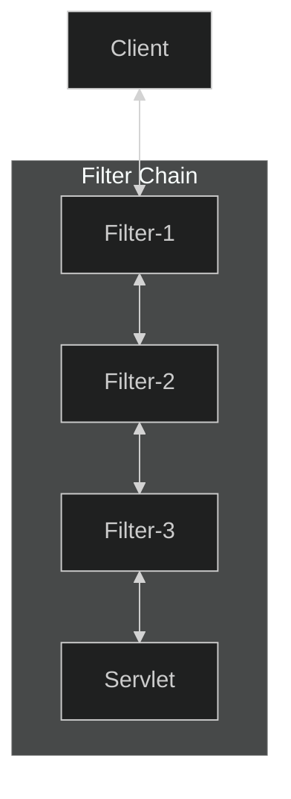
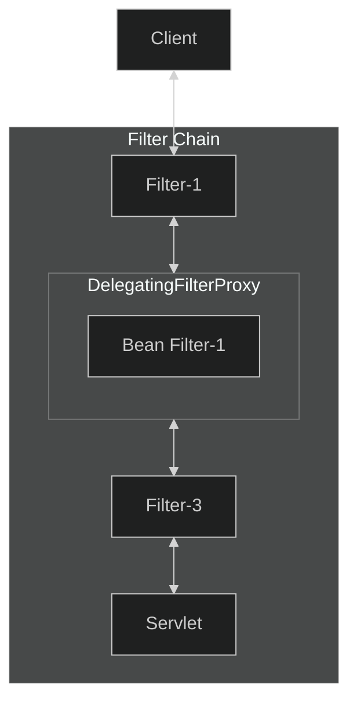
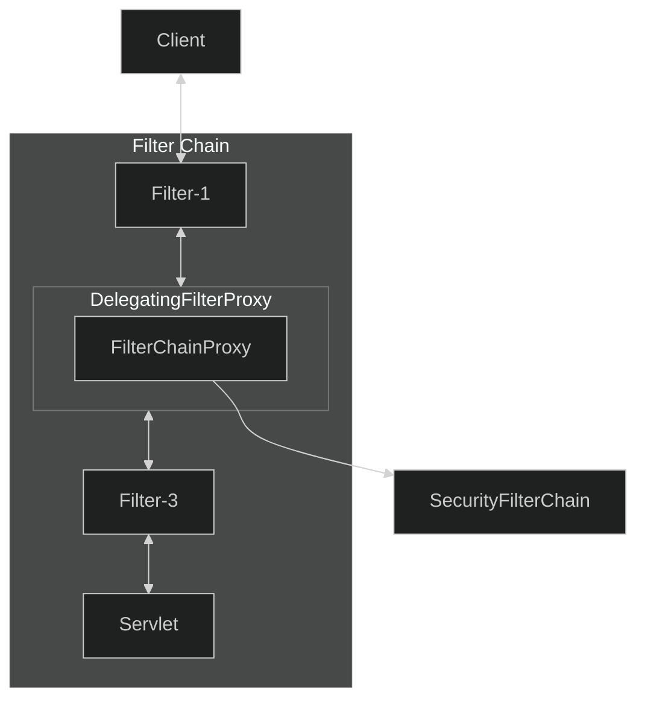
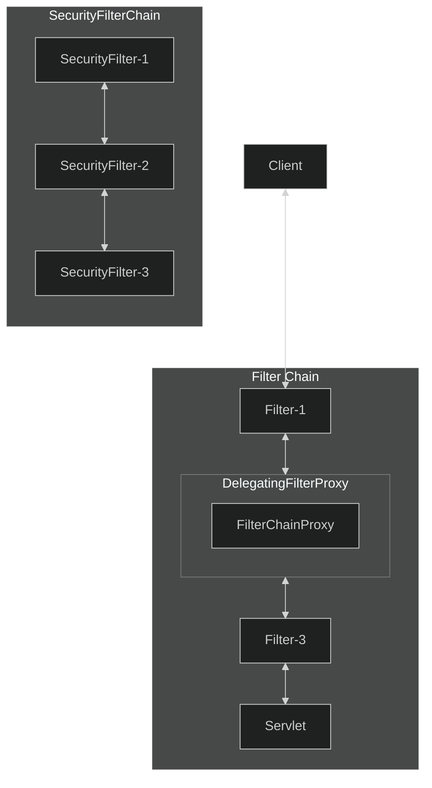

# Spring Boot Security 101

Spring Security is a powerful and highly customizable authentication and authorization (access-control) framework. It
also provides protection against common attacks like CSRF etc. It is the de-facto standard for securing Spring-based
applications.
We will explore the fundamentals of Spring Security in a more detailed and practical manner.

## Project Structure

We have a simple Spring Boot project with a rest controller which talks to a service and returns a string response. The
controller contains a bunch of endpoints that are not secured at the moment, but we will secure them using Spring
Security. There is a reason for having these many endpoints (methods). We will apply different security configurations
to each set of endpoints and see how they behave. The idea is as follows:

| S.No. | Endpoint                | Description                                                                        |
|:-----:|:------------------------|:-----------------------------------------------------------------------------------|
|   1   | `/unsecured/home`       | **NOT SECURED**. Accessible to everyone irrespective of the authentication status. |
|   2   | `/unsecured/about`      | **NOT SECURED**. Accessible to everyone irrespective of the authentication status. |
|       |                         |                                                                                    |
|   3   | `/secured/admin`        | **SECURED**. Accessible only to authenticated users with the role `ADMIN`.         |
|   4   | `/secured/user`         | **SECURED**. Accessible only to authenticated users with role `ADMIN` or `USER`.   |
|   5   | `/secured/other`        | **SECURED**. Accessible only to authenticated users with any roles.                |
|       |                         |                                                                                    |
|   6   | `/api/admin`            | **SECURED**. Accessible only to authenticated users with the role `ADMIN`.         |
|   7   | `/api/user`             | **SECURED**. Accessible only to authenticated users with role `ADMIN` or `USER`.   |
|   8   | `/api/other`            | **SECURED**. Accessible only to authenticated users with any roles.                |
|       |                         |                                                                                    |
|   9   | `/secured-by-default/1` | **SECURED BY DEFAULT**. Accessible only to authenticated users.                    |
|  10   | `/secured-by-default/2` | **SECURED BY DEFAULT**. Accessible only to authenticated users.                    |
|       |                         |                                                                                    |
|  11   | `/deny/1`               | **SECURED**. Access **DENIED** to all users.                                       |
|  12   | `/deny/2`               | **SECURED**. Access **DENIED** to all users.                                       |

The goal is to understand the security configurations indepth and in a step-by-step manner.

## About Tests

At the moment, We have the below unit and integration tests.

1. `SampleServiceUnitTest.java`
2. `SampleControllerUnitTest.java`
3. `SampleControllerMockMvcUnitTest.java`
4. `SampleControllerMockIntegrationTest.java`
5. `SampleControllerServerIntegrationTest.java`

The reason we have these many tests is to understand different testing approaches and the limitations and problems with
those approaches, especially when working with Spring Security.

> [!NOTE]
> Both `SampleControllerUnitTest` and `SampleControllerMockMvcUnitTest` are unit tests but with different approaches.
> They behave differently when we introduce Spring Security into our project. We will see how to update them to make
> it work with Spring Security.

> [!NOTE]
> Both `SampleControllerMockIntegrationTest` and `SampleControllerServerIntegrationTest` are integration tests but with
> some differences like mock server vs. live server etc. We will see how they behave with Spring Security and how to
> update them to make it work with Spring Security.

### SampleServiceUnitTest

The `SampleServiceUnitTest.java` is a pure unit test with a mocked `HttpServletRequest`. It is pretty straightforward.

### SampleControllerUnitTest

The `SampleControllerUnitTest.java` is also a pure unit test without involving any of the Spring support. It is not
annotated with `@SpringBootTest` or `@WebMvcTest`. So no Spring magic is involved. We are using the
`RestTestClient.bindToController(...)` method which allows us to test specific controller(s) via mock request/response
objects, without running a live server.

In this approach **We** are responsible for creating the controller instance as the Spring container is not set up
during these tests. This also means that if our controller has any dependencies, then **we** need to mock and inject
them ourselves. Since our controller depends on the `SampleService` we are mocking the `SampleService` and injecting it
into the controller.

> [!WARNING]
> The above approach performs pure unit tests without loading the full Spring context. It bypasses all Spring
> infrastructure, such as security configurations, security filters, validations, request/response handling, etc. and
> focuses solely on the controller's logic in isolation. So it does not test any security-specific behavior.

### SampleControllerMockMvcUnitTest

The `SampleControllerMockMvcUnitTest.java` is also a unit test (slice test) which is annotated with `@WebMvcTest` which
brings in some limited Spring support. `@WebMvcTest` is a specialized annotation used for testing only the web layer of
an application, that focuses only on _Spring MVC_ components. It automatically injects `MockMvc` to simulate HTTP
requests and inspect responses without starting a real live server. It is called slice testing (unit testing
controllers) and not a full integration testing.

When we need to test Spring MVC features like security, we need to bind the `RestTestClient` to a `MockMvc` instance
using the `RestTestClient.bindTo(mockMvc)` method.

By binding the `RestTestClient` to `MockMvc`, the test simulates the full MVC stack without running a real HTTP
server but a mock server. This allows testing our controllers, including security, validation, exception handling, etc.,
while keeping the tests relatively fast.

The easiest way to set up a `MockMvc` in a `@WebMvcTest` is by directly autowiring it like below:

```java
@WebMvcTest(controllers = SampleController.class)
class SampleControllerMockMvcUnitTest {

    @Autowired
    private MockMvc mockMvc;
}
```

We can set up a `MockMvc` in a `@SpringBootTest` like below:

```java
@SpringBootTest(webEnvironment = SpringBootTest.WebEnvironment.MOCK)
@AutoConfigureMockMvc
class SampleControllerMockMvcUnitTest {

    @Autowired
    private MockMvc mockMvc;
}
```

> [!NOTE]
> By default, tests that are annotated with `@WebMvcTest` will autoconfigure Spring Security and `MockMvc`. For more
> fine-grained control and customization of `MockMVC` the `@AutoConfigureMockMvc` annotation can be used.

> [!NOTE]
> Typically `@WebMvcTest` is used in combination with `@MockitoBean` or `@Import` to create any collaborators required
> by the `@Controller` beans.

> [!NOTE]
> If you want to load full application context with all configurations and along with `MockMVC`, you should consider
> `@SpringBootTest` combined with `@AutoConfigureMockMvc` rather than `@WebMvcTest` annotation.

> [!NOTE]
> We have used `@MockitoBean` annotation to bring a mocked `SampleService` which is different from the previous
> `Mockito.mock(SampleService.class)` approach.
>
> The `Mockito.mock(SampleService.class)` approach does not work with `@WebMvcTest` while `@MockitoBean` does. It is due
> to how Spring manages the application context in _slice_ tests like `@WebMvcTest`.
>
> `@WebMvcTest` loads a specific _slice_ of the application context, primarily for the web layer. It does not load the
> full application context or automatically scan all service or repository components.
>
> `Mockito.mock()` creates a standalone mock object that is not a Spring bean and is not part of the application
> context. The Spring-managed components (like our controllers) have no way to know about or use this non-Spring mock
> object, so the real dependencies (if found or autoconfigured) are injected. Since we restricted the test to load only
> the `SampleController` using `@WebMvcTest(controllers = SampleController.class)`, the real `SampleService` is not
> loaded and throws a `NoSuchBeanDefinitionException` exception.
>
> `@MockitoBean` tells Spring to add a mock for a specific type to the application context, replacing any existing bean
> of that type or creating a new one if it doesn't exist. This mock is then properly injected into other Spring-managed
> components, like our controller, making it accessible to the test environment.

### SampleControllerMockIntegrationTest

The `SampleControllerMockIntegrationTest.java` is an integration test with mock server (not real http server). It is
annotated with `@SpringBootTest(webEnvironment = WebEnvironment.MOCK)` which brings up the full Spring context but
with a mock server. Since it is just a mock server (no real server started), complete url or port number is not
needed to make requests. It internally uses `MockMvc` to make requests. Since the full application context is loaded,
all the security-related configurations will also be loaded, and we can test against it.

### SampleControllerServerIntegrationTest

The `SampleControllerServerIntegrationTest.java` is a complete integration test similar to
`SampleControllerMockIntegrationTest` but with **real live http server** (_not mock server_) and without any mocks. It
is the same way as clients would consume it over HTTP. It is annotated with `@SpringBootTest(webEnvironment = 
WebEnvironment.RANDOM_PORT)` which brings up the full Spring application context and starts a live server on a random
port. We are using the `RestTestClient.bindToServer()` method with base url and port number to connect to a running live
server to perform a full end-to-end HTTP test. This approach connects to a live server using the real HTTP protocol,
validating full request-response cycles. It is useful for testing CORS, compression, or other network-level behavior
that **cannot** be verified in a web slice tests like `@WebMvcTest` or mock-based test like
`@SpringBootTest(webEnvironment = WebEnvironment.MOCK)`.

## Mockito Extension

The Mockito Extension for JUnit 5 is to simplify the initialization and injection of Mockito mocks in unit tests by
integrating with the JUnit 5 extension model. The primary function of the `MockitoExtension` is to reduce boilerplate
code associated with manual mock creation and injection. Instead of manually creating and injecting mocks using `Mockito.
mock()` the extension automatically initializes fields annotated with `@Mock` and injects them into instances annotated
with `@InjectMocks`.

### @Mock

The `@Mock` annotation in Mockito is a shorthand, convenient, declarative way to create a mock object of a specified
class or interface for use in unit tests. It simplifies code by eliminating the need for repeatedly calling the static
`Mockito.mock()` method.

Using `@Mock` on a field in a test class is equivalent to manually calling `Mockito.mock()` method. This makes the test
code more readable and concise.

### @InjectMocks

The primary advantage of using `@Mock` is its seamless integration with the `@InjectMocks` annotation. `@InjectMocks`
creates a real instance of the class you want to test and automatically injects any fields in that instance that are
annotated with `@Mock`.

When both `@Mock` and `@InjectMocks` are used, Mockito automatically attempts to inject the `@Mock` annotated object
into the fields of the class annotated with `@InjectMocks`.

> [!WARNING]
> The `@ExtendWith(MockitoExtension.class)` annotation is mandatory in order for `@Mock` to work. It tells JUnit to
> register and use the Mockito extension to enable the functionalities of Mockito specific annotations like `@Mock` and
`@InjectMocks` etc.

The below two approaches are exactly the same.

```java
class Demo {

    private final SampleService    mockSampleService = Mockito.mock(SampleService.class);
    private final SampleController sampleController  = new SampleController(mockSampleService);
}
```

```java
@ExtendWith(MockitoExtension.class)
class Demo {

    @Mock
    private SampleService mockSampleService;

    @InjectMocks
    private SampleController sampleController;
}
```

## Introduced Spring Security

To get started with Spring Security, we will add `spring-boot-starter-security` and `spring-boot-starter-security-test`
dependencies to our project. The `spring-boot-starter-security` and `spring-boot-starter-security-test` aggregates
**Spring Security** and **Spring Security Test** related dependencies.

> [!TIP]
> The spring-boot-starter-security-test provides autoconfiguration for testing applications secured with Spring
> Security. It simplifies the process of writing integration and unit tests for secured endpoints by providing essential
> utilities like mocking users and security contexts.

Add the above-mentioned starters to the project and run the application. The following snippet shows some of the output
that indicates that Spring Security is enabled in our application:

```terminaloutput
2026-03-07T11:27:37.018+05:30  WARN 4743 --- [spring-boot-security-101] [           main] .s.a.UserDetailsServiceAutoConfiguration :
Using generated security password: 01920814-b5af-4049-b757-f1c984bc43a6
This generated password is for development use only. Your security configuration must be updated before running your application in production.
2026-03-07T11:27:37.072+05:30  INFO 4743 --- [spring-boot-security-101] [           main] r$InitializeUserDetailsManagerConfigurer : Global AuthenticationManager configured with UserDetailsService bean with name inMemoryUserDetailsManager
2026-03-07T11:27:37.325+05:30  INFO 4743 --- [spring-boot-security-101] [           main] o.s.boot.tomcat.TomcatWebServer          : Tomcat started on port 8080 (http) with context path '/'
2026-03-07T11:27:37.338+05:30  INFO 4743 --- [spring-boot-security-101] [           main] d.b.s.SpringBootSecurity101Application   : Started SpringBootSecurity101Application in 2.335 seconds (process running for 3.23)
```

> [!NOTE]
> If Spring Security is enabled (by adding the `spring-boot-starter-security` dependency), and no explicit security
> related configuration is provided, then a default login and logout pages will be created. An in-memory user with
> username `user` and a random generated password is configured automatically.

### Try hitting an endpoint and see what happens

If we provide the url `http://localhost:8080/unsecured/home` in a browser, it will redirect to a default login page.
Providing `user` as the username and the generated password from the console as password and clicking on the login
button will take you to the respective page or return `/UNSECURED/HOME` in our case. This is called **Form login** or
**Form-based authentication**.

Hitting the same url from _Postman_ or any other non-browser client like curl etc. **without credentials** returns a
`401 Unauthorized` http status code.

Hitting the same url from _Postman_ **with credentials** by selecting `Basic Auth` on the `Authorization` tab. Sending
the request now will return `/UNSECURED/HOME` as response with a `200 OK` http status code. This is called **Http Basic
authentication**.

> [!WARNING]
> Some of our tests are failing now, and we will explore and fix them in the upcoming commits.

Intentionally, we did not make any code changes in this commit except adding Spring Security and Spring Security
Test dependencies and updating this readme file. We are just trying to observe what has happened.
There are many things happened behind the scenes, but the below are the most notable:

1. Spring Security secured all our endpoints automatically and required an **authenticated** user for any endpoint.
2. Spring Security registers a default user with the username `user` and a random generated password at startup that is
   logged to the console.
3. Spring Security created a default login and logout page.
4. The `SampleControllerMockMvcUnitTest` unit test and `SampleControllerMockIntegrationTest` and
   `SampleControllerServerIntegrationTest` integration tests are now failing with the below message:
   ```
   java.lang.AssertionError: Status expected:<200 OK> but was:<401 UNAUTHORIZED>
   Expected :200 OK
   Actual   :401 UNAUTHORIZED
   ```
5. The `SampleServiceUnitTest` and `SampleControllerUnitTest` unit tests are still passing.

> [!NOTE]
> The `SampleServiceUnitTest` and `SampleControllerUnitTest` unit tests are passing, and that makes sense because they
> were just method calls between classes and does not involve any security. We will further explore this when we talk
> about `Method Security`.

> [!WARNING]
> Our tests are failing at the moment, which is not good, and we will fix them in the upcoming commits.

## Overriding the default username and password

In the earlier section we have seen that Spring Security automatically created a default (in-memory) user with the
username `user` and a random generated password at startup. In fact, those are the credentials we used in the login
page and also in _Postman_. It is a good start but not handy as we have to pick the password from the console everytime.

We can override that default username and the random generated password using the below properties in the
`application.properties` file.

```properties
spring.security.user.name     = dev-user-1
spring.security.user.password = dev-password-1
spring.security.user.roles    = USER
```

With the above properties, we can now use `dev-user-1` and `dev-password-1` as the credentials in the login page and in
_Postman_. Try hitting the url `http://localhost:8080/unsecured/home` in the browser and also in _Postman_ with the
new credentials and make sure it works as expected.

> [!NOTE]
> Spring Security now creates an in-memory user same as before but this time with `dev-user-1` as username and
> `dev-password-1` as password with role `USER`. We will talk about roles in the upcoming commits.

> [!WARNING]
> Hardcoding credentials in the `application.properties` file using these properties is useful for _development_ and
> _testing_ purposes but **not recommended for production environments**.

> [!NOTE]
> The above approach gives us a fixed username and password which can be used in the login page and in _Postman_ but
> it does not fix our failing tests. We will fix the tests in the upcoming commits.

## Fixing The Tests

If we observe our tests, they all are failing for the below reason:

```terminaloutput
java.lang.AssertionError: Status expected:<200 OK> but was:<401 UNAUTHORIZED>
Expected :200 OK
Actual   :401 UNAUTHORIZED
```

It clearly states that we are expecting a `200 OK` but getting a `401 UNAUTHORIZED` http status code.

Our tests are making requests to specified urls the same way as we do in the browser or in _Postman_ but without
providing any credentials. If no credentials are provided, then there is no authenticated user present. But Spring
Security expects the endpoints should be accessed only by authenticated users (unless we have configured it to allow
anonymous access, which we did not). So it returns a `401 UNAUTHORIZED` http status code which does not match our
test's expectation.

There should be a way to simulate an authenticated user in our tests without involving any real users or credentials.

### Fixing Unit Tests

Unit tests do not start a real server but create a mock server using `MockMvc` we have quite a few options to simulate
an authenticated user.

#### @WithMockUser

`@WithMockUser` is a Spring Security annotation used in testing to simulate a user (an authenticated user) in a test
environment without needing an actual authentication mechanism like a real login form or token. It is often used with
`MockMvc` (`@WebMvcTest`, `@SpringBootTest(webEnvironment = WebEnvironment.MOCK)`) to test secured endpoints in MVC
controllers. It is a part of the `spring-boot-starter-security-test` dependency.

It injects a `SecurityContext` containing a `UsernamePasswordAuthenticationToken` with specified username, password, and
roles.

Basically, `@WithMockUser` allows us to run tests as a specific (mocked) user.
By default, `@WithMockUser` creates a user with username `user`, password `password`, and role `USER` (internally stored
as `ROLE_USER`).

By annotating a test class with `@WithMockUser`, all the tests in that class will run as a user with the username
`user`, password `password`, and role `ROLE_USER`.

> [!NOTE]
> The user with a username of `user` does not have to exist, instead a mock user object will be created.
> The mock user object has a username of `user`.
> The mock user object has a password of `password`.
> The mock user object has a single role as `ROLE_USER`.

While `@WithMockUser` is handy, because it lets us use a lot of defaults. But if we ever want to run a test with a
different username or role, we can do that as below:

`@WithMockUser(username = "john", password = "johnpassword" roles = "USER")`

The above will run a test with `john` as username, `johnpassword` as password with `USER` role.

> [!NOTE]
> You may be wondering how the tests are passing if `@WithMockUser` creates a user with username `user` and password
> `password` and role `ROLE_USER` which does not match our actual credentials (`dev-user-1` and `dev-password-1`). The
> reason is that these tests (only `MockMvc` tests) are run against a mock server (not a real server) and that mock
> server just needs an authenticated user object in the `SecurityContext`. It does not need to be an actual user with
> the same credentials.

> [!TIP]
> `@WithMockUser` can be used at both class and method level. If used at class level, the same credentials will be
> used for all the tests in that class. If used both at class and method level, the method level credentials will
> override the class level credentials for that specific test method.
>
> It is often used at class level to set the default credentials for all the tests in that class and at method level for
> specific tests to override the default credentials.

> [!WARNING]
> As mentioned above, `@WithMockUser` is only for tests that are using `MockMvc` like `@WebMvcTest`,
> `@SpringBootTest(webEnvironment = WebEnvironment.MOCK)` but not for tests that starts a real server like
> `@SpringBootTest(webEnvironment = WebEnvironment.RANDOM_PORT)`. So `@WithMockUser` will not work on our
> `SampleControllerServerIntegrationTest` tests. Since `SampleControllerServerIntegrationTest` starts a real server, we
> need real authentication with real credentials.

### Fixing Integration Tests

Integration tests start a real live server instead of a mock server, we cannot mock authentication instead pass real
credentials. So we have very limited options.

1. We can have a custom security configuration for our integration tests that skips the authentication and allows
   anonymous access.
2. We can pass real credentials.

We will explore custom security configuration in the upcoming commits, but for now let's focus on the second option.
To fix the `SampleControllerServerIntegrationTest` we will pass the real credentials via http headers. We can do
that once for all requests or for individual requests.

If we want to set the same credentials for all requests, then we can do that while constructing the `RestTestClient`
object as below:

```java
RestTestClient restClient = RestTestClient.bindToServer()
                                          .baseUrl("http://localhost:" + port)
                                          .defaultHeaders(
                                                  headers -> headers.setBasicAuth("dev-user-1", "dev-password-1"))
                                          .build();
```

If we want to set different credentials for different requests, then we need to do it on individual requests as below:

```java
RestTestClient restClient = restClient.get()
                                      .uri(uri)
                                      .headers(headers -> headers.setBasicAuth("dev-user-1", "dev-password-1"))
                                      .exchange()
                                      .expectStatus()
                                      .isOk()
                                      .expectBody(String.class)
                                      .isEqualTo(expected);
```

> [!TIP]
> We can also set default headers for all requests and override them on individual requests too.

## Test Specific Credentials

If we do not want to use the credentials from the `application.properties` file and want to have credentials specific
to tests then we can use the `@TestPropertySource` annotation and define the credentials in the test class itself.
These credentials are specific to that test class and will be used for all the tests in that class. We can further
move this to a `@TestConfiguration` class and use it all the tests using `@Import` annotation.

We overrode the default username and password in the `application.properties` with the test-specific credentials
defined in the `SampleControllerServerIntegrationTest` class. `SampleControllerServerIntegrationTest` will now use
`test-user` and `test-password` as credentials instead of `dev-user-1` and `dev-password-1`.

## @WithAnonymousUser

While `@WithMockUser` is used to run tests as an authenticated user, `@WithAnonymousUser` in contrast allows tests to
run as an anonymous user. This is especially useful when you want to run most tests with an authenticated user but few
tests as an anonymous (unauthenticated) user as authentication is not needed to access some endpoints.
Also, useful when testing negative scenarios like accessing a secured endpoint without authentication should return
`401 Unauthorized`.

| Annotation           | Purpose                                    | Usage Context                                              |
|----------------------|--------------------------------------------|------------------------------------------------------------|
| `@WithMockUser`      | Simulates an authenticated user for tests. | When you need to test methods requiring authentication.    |
| `@WithAnonymousUser` | Simulates an anonymous user for tests.     | When you want to run methods not requiring authentication. |

In `SampleControllerMockMvcUnitTest` and `SampleControllerMockIntegrationTest` tests we have used `@WithMockUser` at
class level to run all tests with an authenticated user. Later we are overriding that with `@WithAnonymousUser` at
method level in some tests to run the test as an anonymous (unauthenticated) user and make sure that the endpoint is not
accessible without authentication and returns `401 Unauthorized`.

In `SampleControllerServerIntegrationTest` test we have removed the basic authentication default header (by overriding
at method level) from the `RestTestClient` only for a specific test method and run the test as an unauthenticated user
and make sure that the endpoint is not accessible without authentication and returns `401 Unauthorized`.

## Filter and FilterChain

Now that we have known a little bit of Spring Security, We need to dive deeper into the internals of Spring Security.
How Spring Security is able to intercept all the incoming requests and force authentication before they reach the
target controller. To do that, We need to understand the concept of **Filters** and **FilterChain** which are the basic
building blocks of Spring Security.

In a web application, any HTTP request sent by the client is, by default, passed directly to the target servlet. The
response that the target servlet generates is, by default, passed directly back to the client with its content
unmodified. Here the servlet is processing the request and generating the response that the application requires.

But there are cases where some pre-processing of the request and some post-processing of the response would be needed.
If the pre-processing and post-processing are needed only for a single servlet, then we can do it directly in the
respective servlet itself. But what if the same kind of pre-processing and post-processing is needed in multiple
servlets?

Let's say we want to _log_ all the requests coming from the client and _look for a specific HTTP header_ in the request
before they reach the target servlet (Pre Processing). Once the request is processed by the target servlet, we want to
_add a specif HTTP header_, _encrypt_ and _compress_ the response before it is sent to the client (Post Processing).

Filters and FilterChains are the way to achieve this.

### Filter

A **Filter** is a Java object that can:

* intercept requests coming from a client before it reaches the target servlet.
* intercept responses coming from a servlet before it reaches the client.
* use and/or modify the information contained in the requests before it reaches the target servlet.
* use and/or modify the information contained in the response after they are generated but before it is sent to the
  client.

Basically filters are used for _pre-processing_ _requests_ and _post-processing responses_.

Typical filters include:

* Logging filter.
* Authentication filter.
* Encryption filter.
* Compression filter.

### FilterChain

A **FilterChain** as the name suggests, is a chain of filters. It is an ordered collection of independent filters.
Each filter has its own responsibility and **FilterChain** coordinates their processing. It provides a mechanism for
passing a request and response to the next filter in the chain.

Filters can be chained together so that a group of filters can act on the input and output of a specified resource or
group of resources.

A typical implementation of a FilterChain would follow the following pattern:

1. The client sends a request.
2. The web container determines the applicable filters and creates a FilterChain.
3. The container invokes the `doFilter()` method of the first filter in the chain.
4. Within the filter's `doFilter()` method, any code before `chain.doFilter()` is executed as pre-processing.
5. `chain.doFilter()` calls the next filter (or the target servlet if it is the last filter in the chain).
6. When the target servlet finishes, control returns up the chain.
7. Any code after `chain.doFilter()` in the filter's method is executed as post-processing and calls the previous
   filter in the chain.
8. The final response is sent back to the client.

The below sequence diagram shows the flow of a FilterChain with two filters which work on the request (pre-process) and
three filters which work on the response (post-process).

<p align="center">

</p>


## Spring Security Architecture

Spring Security’s Servlet support is completely based on Servlet Filters, and it is important to understand how they
work. If the above sequence diagram is confusing, then let's break it down a little bit.

The following image shows the typical layering of the handlers for a single HTTP request.



<p align="center">


</p>


The client sends a request to the application, and the servlet container creates a `FilterChain`, which contains the
`Filter` instances, and a `Servlet` that should process the `HttpServletRequest`, based on the path of the request URI.
In a Spring MVC application, the `Servlet` is an instance of `DispatcherServlet`. At most, one `Servlet` can handle a
single `HttpServletRequest` and `HttpServletResponse`. However, more than one `Filter` can be used to:

1. Prevent downstream `Filter` instances or the `Servlet` from being invoked. In this case, typically the `Filter`
   itself writes the `HttpServletResponse`.
2. Modify the `HttpServletRequest` or `HttpServletResponse`, which is then used by the downstream `Filter` instances and
   the `Servlet`.

The power of the Filter comes from the FilterChain that is passed into it.

```java

@Override
public void doFilter(ServletRequest request, ServletResponse response, FilterChain chain) throws
                                                                                          IOException,
                                                                                          ServletException {
    // do something before the rest of the application
    chain.doFilter(request, response); // invoke the rest of the application
    // do something after the rest of the application
}
```

> [!TIP]
> Since a `Filter` impacts only downstream `Filter` instances and the `Servlet`, the order in which each `Filter` is
> invoked is extremely important.

### DelegatingFilterProxy

The Servlet container allows registering `Filter` instances by using its own standards, but it is not aware of
Spring-defined Beans. Spring provides a `Filter` implementation named `DelegatingFilterProxy` that allows bridging
between the Servlet container’s lifecycle and Spring’s `ApplicationContext`. We can register `DelegatingFilterProxy`
through the standard Servlet container mechanisms but delegate all the work to a Spring Bean that implements `Filter`.

Here is a picture of how `DelegatingFilterProxy` fits into the `Filter` instances and the `FilterChain`.



`DelegatingFilterProxy` looks up `Bean Filter-1` from the `ApplicationContext` and then invokes `Bean Filter-1`. The
following listing shows pseudocode of `DelegatingFilterProxy`:

```java
public void doFilter(ServletRequest request, ServletResponse response, FilterChain chain) {
    Filter delegate = getFilterBean(someBeanName);
    delegate.doFilter(request, response);
}
```

- The `getFilterBean(...)` lazily get `Filter` that was registered as a Spring Bean. For example, in
  `DelegatingFilterProxy` `delegate` is an instance of `Bean Filter-1`.
- `delegate.doFilter(...)` delegate work to the Spring Bean.

> [!INFO]
> Another benefit of `DelegatingFilterProxy` is that it allows delaying looking up `Filter` bean instances. This is
> important because the container needs to register the `Filter` instances before the container can start up. However,
> Spring typically uses a `ContextLoaderListener` to load the Spring Beans, which is not done until after the `Filter`
> instances need to be registered.

### FilterChainProxy

Spring Security’s Servlet support is contained within `FilterChainProxy`. `FilterChainProxy` is a special `Filter`
provided by Spring Security that allows delegating to many `Filter` instances through `SecurityFilterChain`. Since
`FilterChainProxy` is a `Bean`, it is typically wrapped in a `DelegatingFilterProxy`.

The following image shows the role of `FilterChainProxy`.




