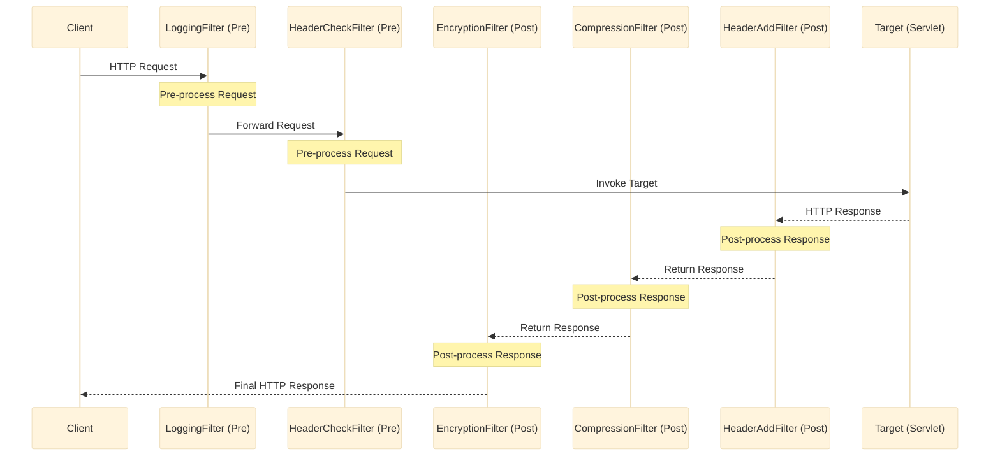
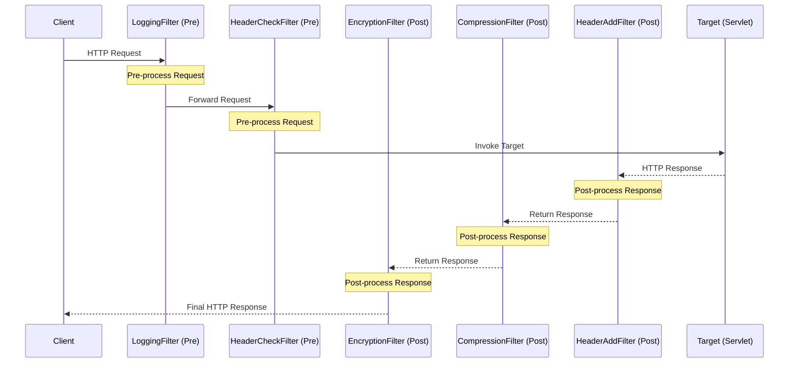
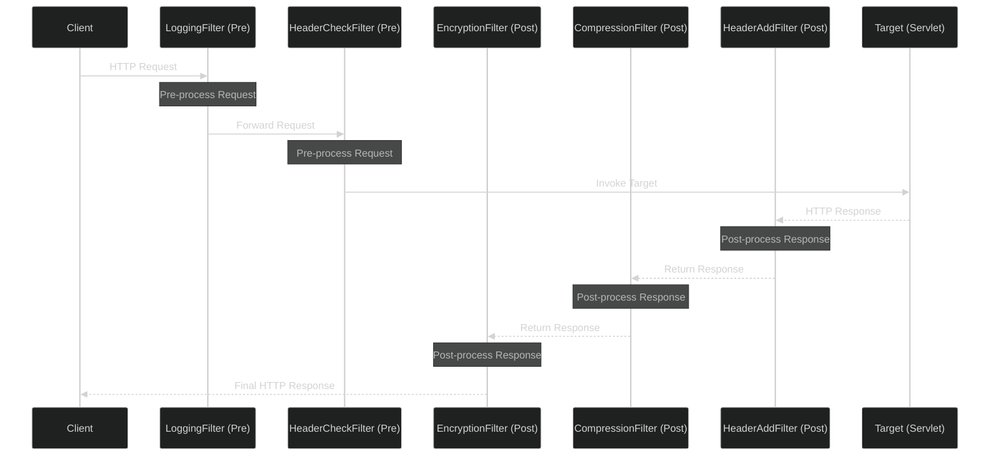
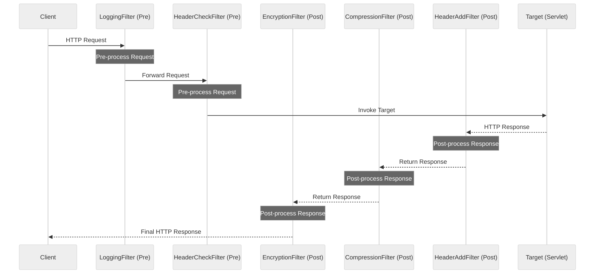
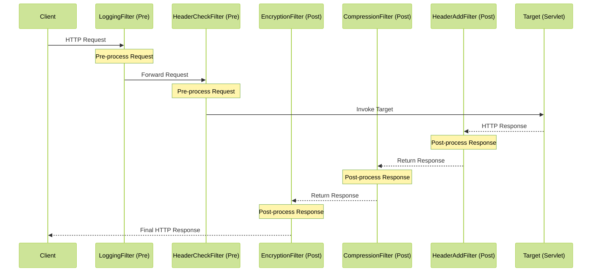

Base

```mermaid
%%{init: {'theme': 'base'}}%%
sequenceDiagram
    participant C as Client
    participant F1 as LoggingFilter (Pre)
    participant F2 as HeaderCheckFilter (Pre)
    participant F3 as EncryptionFilter (Post)
    participant F4 as CompressionFilter (Post)
    participant F5 as HeaderAddFilter (Post)
    participant T as Target (Servlet)

    C->>F1: HTTP Request
    Note over F1: Pre-process Request
    F1->>F2: Forward Request
    Note over F2: Pre-process Request
    F2->>T: Invoke Target
    T-->>F5: HTTP Response
    Note over F5: Post-process Response
    F5-->>F4: Return Response
    Note over F4: Post-process Response
    F4-->>F3: Return Response
    Note over F3: Post-process Response
    F3-->>C: Final HTTP Response
```

Default

```mermaid
%%{init: {'theme': 'default'}}%%
sequenceDiagram
    participant C as Client
    participant F1 as LoggingFilter (Pre)
    participant F2 as HeaderCheckFilter (Pre)
    participant F3 as EncryptionFilter (Post)
    participant F4 as CompressionFilter (Post)
    participant F5 as HeaderAddFilter (Post)
    participant T as Target (Servlet)

    C->>F1: HTTP Request
    Note over F1: Pre-process Request
    F1->>F2: Forward Request
    Note over F2: Pre-process Request
    F2->>T: Invoke Target
    T-->>F5: HTTP Response
    Note over F5: Post-process Response
    F5-->>F4: Return Response
    Note over F4: Post-process Response
    F4-->>F3: Return Response
    Note over F3: Post-process Response
    F3-->>C: Final HTTP Response
```

Dark

```mermaid
%%{init: {'theme': 'dark'}}%%
sequenceDiagram
    participant C as Client
    participant F1 as LoggingFilter (Pre)
    participant F2 as HeaderCheckFilter (Pre)
    participant F3 as EncryptionFilter (Post)
    participant F4 as CompressionFilter (Post)
    participant F5 as HeaderAddFilter (Post)
    participant T as Target (Servlet)

    C->>F1: HTTP Request
    Note over F1: Pre-process Request
    F1->>F2: Forward Request
    Note over F2: Pre-process Request
    F2->>T: Invoke Target
    T-->>F5: HTTP Response
    Note over F5: Post-process Response
    F5-->>F4: Return Response
    Note over F4: Post-process Response
    F4-->>F3: Return Response
    Note over F3: Post-process Response
    F3-->>C: Final HTTP Response
```

Neutral

```mermaid
%%{init: {'theme': 'neutral'}}%%
sequenceDiagram
    participant C as Client
    participant F1 as LoggingFilter (Pre)
    participant F2 as HeaderCheckFilter (Pre)
    participant F3 as EncryptionFilter (Post)
    participant F4 as CompressionFilter (Post)
    participant F5 as HeaderAddFilter (Post)
    participant T as Target (Servlet)

    C->>F1: HTTP Request
    Note over F1: Pre-process Request
    F1->>F2: Forward Request
    Note over F2: Pre-process Request
    F2->>T: Invoke Target
    T-->>F5: HTTP Response
    Note over F5: Post-process Response
    F5-->>F4: Return Response
    Note over F4: Post-process Response
    F4-->>F3: Return Response
    Note over F3: Post-process Response
    F3-->>C: Final HTTP Response
```

Forest

```mermaid
%%{init: {'theme': 'forest'}}%%
sequenceDiagram
    participant C as Client
    participant F1 as LoggingFilter (Pre)
    participant F2 as HeaderCheckFilter (Pre)
    participant F3 as EncryptionFilter (Post)
    participant F4 as CompressionFilter (Post)
    participant F5 as HeaderAddFilter (Post)
    participant T as Target (Servlet)

    C->>F1: HTTP Request
    Note over F1: Pre-process Request
    F1->>F2: Forward Request
    Note over F2: Pre-process Request
    F2->>T: Invoke Target
    T-->>F5: HTTP Response
    Note over F5: Post-process Response
    F5-->>F4: Return Response
    Note over F4: Post-process Response
    F4-->>F3: Return Response
    Note over F3: Post-process Response
    F3-->>C: Final HTTP Response
```
