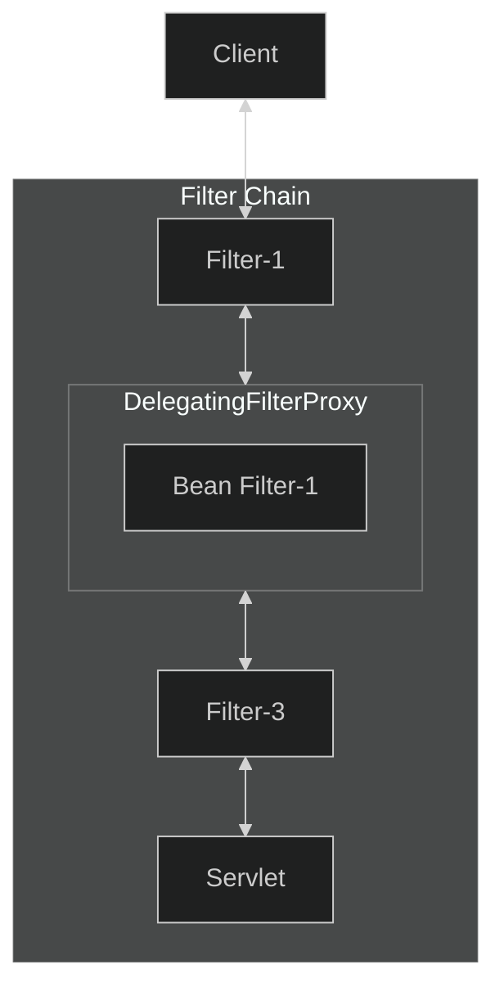
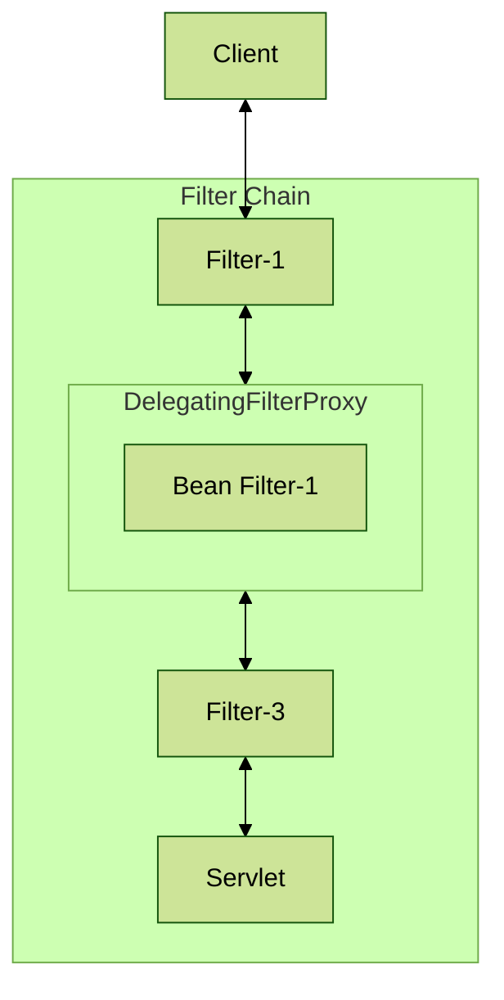

```mermaid
%%{init: {'theme': 'dark'}}%%
graph TB
    Client[Client] <--> Filter-1

    subgraph FilterChain[Filter Chain]
        direction TB
        Filter-1[Filter-1] <--> DelegatingFilterProxy
        subgraph DelegatingFilterProxy[DelegatingFilterProxy]
            direction TB
            BeanFilter-1[Bean Filter-1]
        end
        DelegatingFilterProxy <--> Filter2[Filter-3] <--> Servlet[Servlet]
    end
```

```mermaid
%%{init: {'theme': 'forest'}}%%
graph TB
    Client[Client] <--> Filter-1

    subgraph FilterChain[Filter Chain]
        direction TB
        Filter-1[Filter-1] <--> DelegatingFilterProxy
        subgraph DelegatingFilterProxy[DelegatingFilterProxy]
            direction TB
            BeanFilter-1[Bean Filter-1]
        end
        DelegatingFilterProxy <--> Filter2[Filter-3] <--> Servlet[Servlet]
    end
```
